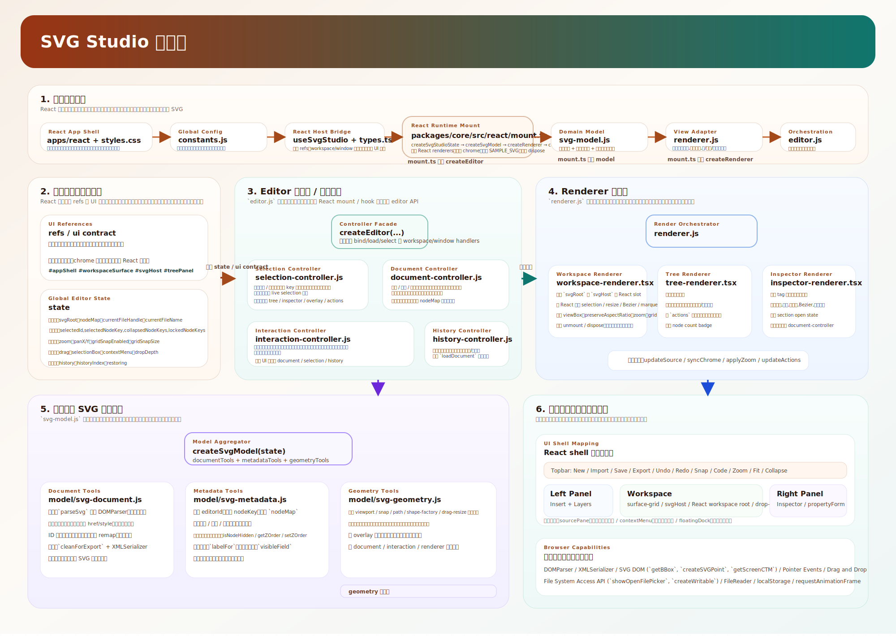

# SVG Studio

A browser-based SVG visual editor that runs directly in the browser with no build step. It is designed for front-end developers, design collaborators, and anyone who needs to inspect, adjust, and export SVG files with a practical editing workflow.



## Overview

`SVG Studio` is the SVG tool inside the `front-end_toolkit` repository. It is not intended to replace Illustrator, Figma, or Inkscape. The goal is to provide a lighter browser-side editor that fits front-end delivery workflows more naturally.

This directory now supports two execution paths:

- `legacy static`: keep using [index.html](./index.html) with no build step
- `modern workspace`: run React + TypeScript or Vue + TypeScript hosts through Vite

Current migration status:

- `React`: the app shell is now rendered as a real React component tree and mounted through typed DOM refs
- `Vue`: currently remains on the compatibility host path and still bootstraps the legacy editor shell

Typical use cases include:

- Inspecting and editing SVG assets used in product interfaces
- Adjusting the structure of illustrations, icons, diagrams, and posters
- Updating colors, dimensions, text, paths, and layer order
- Switching between visual editing and raw SVG source editing
- Cleaning imported SVG before exporting it back into a front-end codebase

## What Is Already Implemented

This project is already a working static application, not just a design draft.

### 1. Document and file operations

- Loads a sample SVG on startup for immediate exploration
- Create a new empty SVG document
- Import local SVG files
- Export the current result as a new `.svg` file
- Overwrite-save the original file in browsers that support the File System Access API

### 2. Canvas and view controls

- Zoom in, zoom out, and fit to view
- Pan the canvas by dragging with the right mouse button
- Toggle grid snapping
- Set a custom grid snap size
- Persist grid snap preferences in local browser storage

### 3. Element insertion

The left `Insert` panel can add the following elements directly:

- `rect`
- `circle`
- `ellipse`
- `line`
- `text`
- `polyline`
- `polygon`
- `path`
- `image`

Images can be inserted through the file picker or by dragging image files into the workspace.

### 4. Layer tree and structure browsing

- View the SVG node hierarchy
- Expand and collapse groups
- Select nodes from the layer tree
- Show and hide layers
- Lock and unlock layers
- Display the current node count

### 5. Visual editing

- Click to select elements
- Drag a selection box to select multiple elements
- Drag selected elements to move them
- Resize shapes through control handles
- Move multiple selected elements together
- Use the context menu to bring elements to front or send them to back
- Duplicate and delete selected elements
- Undo and redo editing history

### 6. Inspector panel

The right `Inspector` panel renders editable fields dynamically based on the selected element type.

Supported fields include:

- Basic attributes: `id`, `class`, `opacity`, `transform`
- Appearance: `fill`, `stroke`, `stroke-width`
- Geometry:
  - `x`, `y`, `width`, `height` for `rect`, `image`, `use`, and `text`
  - `cx`, `cy`, `r` for `circle`
  - `cx`, `cy`, `rx`, `ry` for `ellipse`
  - `x1`, `y1`, `x2`, `y2` for `line`
- Typography: `font-family`, `font-size`, `font-weight`, `font-style`, `text-decoration`, `letter-spacing`, `text-anchor`
- Content: text content, `path d`, and `points`
- Layer order through direct z-order editing

There are also shape-specific editing helpers:

- `polygon`: change side count and rebuild as a regular polygon
- `polyline`: resample the number of points
- `path`: edit Bezier control data

### 7. Source mode

- Open the `Code` panel to inspect the current SVG source
- Edit raw SVG text directly
- Click `Apply` to reparse the source and sync it back into the canvas
- Use source mode for attributes and structures that are easier to edit as code

## Quick Start

### Option 0: Run the React / Vue + TypeScript workspace

Install dependencies once:

```powershell
cd D:\Algo\Projects\front-end_toolkit\svg
npm install
```

Start the React host:

```powershell
npm run dev:react
```

Start the Vue host:

```powershell
npm run dev:vue
```

Build both modern targets:

```powershell
npm run build
```

Build outputs:

- `svg/dist/react/`
- `svg/dist/vue/`

### Option 1: Open directly

1. Go into the `svg/` directory.
2. Open [index.html](./index.html) in a browser.

This is the fastest way to preview and use the editor, but overwrite-saving the original file is usually unavailable in this mode.

### Option 2: Run a local static server

If you want better browser compatibility for local file workflows, especially overwrite-save behavior, run the project through a local static server:

```powershell
cd D:\Algo\Projects\front-end_toolkit\svg
python -m http.server 8080
```

Then open:

- [http://localhost:8080](http://localhost:8080)

## Browser Compatibility

Chromium-based browsers are recommended:

- Chrome
- Edge

Compatibility notes:

- Import, export, visual editing, and source editing should work in modern browsers
- Overwrite-save depends on the File System Access API and is typically available only in Chromium browsers under an appropriate secure context
- If file system access is unavailable, the `Save` button is disabled automatically and `Export` remains available

## How To Use

### Basic workflow

1. Open the page and start from the built-in sample SVG
2. Click `Import` to load a local SVG, or click `New` to create an empty document
3. Select an object from the canvas or from the `Layers` panel
4. Edit its properties in the `Inspector`
5. Open `Code` if you need exact source-level changes
6. Click `Export` to download a new SVG, or `Save` to overwrite the source file when supported

### Canvas interactions

- Left click an element to select it
- Drag on empty space to create a selection box
- Drag selected elements to move them
- Drag control handles to resize or edit geometry
- Right-drag to pan the canvas
- Right-click an element to open the context menu

### Layer management

Switch to the `Layers` tab on the left to:

- Browse the node tree
- Collapse complex groups
- Locate the current SVG structure quickly
- Lock nodes you do not want to modify accidentally
- Hide nodes temporarily while editing

### Text editing

When a `text` element is selected, the inspector allows editing of:

- Text content
- Font family
- Font size
- Font weight
- Font style
- Text decoration
- Letter spacing
- Text alignment

### Path and point editing

- `path` elements support Bezier control editing
- `polygon` elements support side-count adjustment and regularization
- `polyline` elements support point-count resampling

These tools are intended for practical geometry adjustment, especially on structured SVG shapes.

## Keyboard Shortcuts

- `Ctrl/Cmd + Z`: Undo
- `Ctrl/Cmd + Shift + Z`: Redo
- `Ctrl/Cmd + S`: Overwrite-save the original file when supported
- `Delete` / `Backspace`: Delete the current selection
- `Escape`:
  - Close the context menu
  - Close the source panel if it is open

## Import and Export Rules

### What happens on import

When SVG is imported, the editor sanitizes part of the content to avoid executing unsafe or external resources in the browser.

Examples include:

- Removing unsafe tags such as `script`, `iframe`, `object`, and `embed`
- Removing event handler attributes such as `onclick`
- Removing external `href` and `src` references
- Cleaning unsafe `style` content and external `url(...)` references

Because of that, some imported SVG files may not remain identical to the original if they depend on external resources or executable content.

### What happens on export

- The editor exports standard SVG text
- Runtime-only `data-editor-*` metadata is removed automatically
- The current edited structure is preserved as much as possible

## Known Limitations

The current version is useful for day-to-day SVG editing and structural adjustments, but it has clear boundaries:

- It is not a full design suite and does not include boolean operations, filter editing, collaboration, or similar advanced features
- Multi-selection is mainly for box selection and moving groups of elements, not full batch property editing
- The current Bezier editing flow is best suited to simpler cubic path cases
- Not every SVG specification feature has a dedicated UI
- Tags, attributes, or references removed by the safety rules are not preserved
- Overwrite-save depends on browser capability and runtime context

## Project Structure

```text
svg/
|-- apps/
|   |-- react/                    # React + TypeScript host
|   `-- vue/                      # Vue + TypeScript host
|-- architecture-diagram.svg      # Project diagram
|-- index.html                    # App entry
|-- package.json                  # Modern workspace scripts
|-- packages/
|   `-- core/                     # Shared shell/bootstrap layer
|-- README.md                     # Current documentation
|-- styles.css                    # App styles
`-- scripts/
    |-- app.js                    # Application bootstrap
    |-- constants.js              # Constants, field config, sample SVG
    |-- context.js                # Global state and UI references
    |-- editor.js                 # Main editor composition
    |-- renderer.js               # Render coordinator
    |-- svg-model.js              # Model aggregation entry
    |-- controllers/
    |   |-- document-controller.js     # Document operations, import/export, field updates
    |   |-- history-controller.js      # Undo and redo
    |   |-- interaction-controller.js  # Mouse interaction, dragging, zoom, shortcuts
    |   `-- selection-controller.js    # Selection, locking, collapse state
    |-- model/
    |   |-- svg-document.js            # SVG parsing, sanitizing, serialization
    |   |-- svg-geometry.js            # Geometry helpers
    |   |-- svg-metadata.js            # Node identity, editability, field visibility
    |   `-- geometry/
    |       |-- drag-resize.js
    |       |-- path-tools.js
    |       |-- shape-factory.js
    |       |-- snap-tools.js
    |       `-- viewport-coords.js
    `-- renderer/
        |-- inspector-renderer.js      # Right-side inspector
        |-- tree-renderer.js           # Left-side layer tree
        `-- workspace-renderer.js      # Canvas and overlay rendering
```

## Refactor Strategy

The current refactor is now split by host:

- `apps/react/` renders the shell with actual React components and mounts the editor through `packages/core/src/react/`
- `apps/vue/` still uses the compatibility shell/bootstrap path
- `packages/core/src/bootstrap.ts` remains for the legacy-compatible hosts

That means the React path has already crossed the first migration boundary away from `app.js + context.js + shell.ts`, while the editing controllers and renderers are still being reused underneath.

## Who This Is For

- Front-end engineers who need to edit SVG quickly
- Design collaborators who need lightweight browser-side adjustments
- Product or engineering teammates who need to inspect SVG structure directly
- Developers who want an SVG editing tool that can run as a simple static page

## Possible Next Improvements

- A more complete path editor
- Dedicated management panels for `defs`, gradients, `symbol`, and `use`
- Alignment, distribution, and guide tools
- Clearer validation and import warnings
- Richer batch editing workflows

## Related Files

- Entry page: [index.html](./index.html)
- Styles: [styles.css](./styles.css)
- Bootstrap: [app.js](./scripts/app.js)
